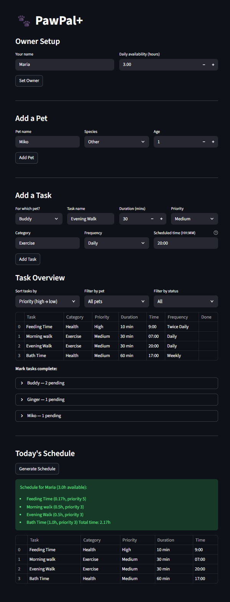

# PawPal+: Applied AI Pet Care System

## Original Project

This project is an extension of **PawPal+**, a Streamlit app that assists pet owners in scheduling and organizing care tasks for their pet. The app prioritized management as it would help owners track daily routines like feedings, walks, medications, and appointments. To bring this app to life, the system was built using Python Object Oriented Programming (OOP) to represent real world elements like Owners, Pets, and Tasks. Additionally, the Manager class handled the scheduling logic for tasks, including planning based on priority, conflict detection, and automatic task recurrence so owners don't have to manually put in a repeating task over and over again. 

## Title and Summary

PawPal+ is an AI-powered pet care management system that helps owners stay on top of their pet's daily needs while feeling confident they are doing what they need to for their fur babies. Built on top of the original PawPal+ scheduling system, this extension utilizes Groq LLM and Retrieval-Augmented Generation (RAG) to add two meaningful features. The first feature is a daily check-in evaluator, where Groq reads the breakdown of what the owner has accomplished that day for their pet and provides a score as well as reassurance and encouragement to keep doing their best. The second feature is a health Q&A assistant that answers pet care questions using a structured knowledge base. Based on the pet's species, the system retrieves the most relevant information before sending it to Groq, so the ansewr is always grounded in real pet care knowledge rather than a guess. The goal of this project is to be that reassuring guide pet owners need when life gets overwhelming because the love for our pets is always there, sometimes people just need a little help making sure it shows up in the right ways.

## Architecture Overview

PawPal+ is organized into two layers that work together to create the full end-to-end system that it is currently. 

The original layer handles the core pet care management. First, the owner sets up their profile, which includes their name and daily availability. Then, the owner adds their pets, which includes the species of the pet and their age. Next, the owner creates tasks they want to complete for each of their pet(s). The Manager class takes all of this information the owner inputted and generates a prioritized schedule that fits within the owner's specified time window. 

The new AI layer sits on top of the original layer, which acts as the foundation for the additional two new intelligent features. The Daily Check-In Evaluator takes the owner's description of their day with their pet, including the activites or errands they did with their pet whether or not it was on the schedule. This information will be compared against the scheduled tasks, and send this comparison to Groq, which acts as our LLM, to generate a score and warm feedback to share with the owner. The Health Q&A uses RAG, meaning the system retrieves the most relevant chunk from the knowledge base based on the owner's pet species. Once it receives this chunk, it sends this and the question the owner asked to Groq. Then, Groq follows the given system prompt, which directs it to give the answer to the owner using real pet care information rather than a hallucination or guess. If Groq sees the opportunity to suggest a task to the owner, it will do so and hand control over to the owner. The owner decides whether or not they want to add the task, and if they do, they can choose how to customize it as well as add it directly to their pet's schedule. 

The data in this system is progressive, meaning it builds as the owner moves through the app. When the owner first opens the app, they can only see the owner setup section. Once they set up their profile, the section to add a pet appears. Once they add at least one pet, the rest of the app becomes visible for them. This includes the task manager, the schedule generator, daily check-in, and health Q&A. From that point forward, the owner chooses in what order they want to go in. They can add tasks manually and generate a schedule, or they can ask a health question first which might suggest a task they had not thought of, and build their schedule from there. The two AI features feed into the same scheduling system, so everything the owner does eventually connects back to their pet's care plan. For a full visual breakdown of this flow, see `assets/system_architecture.png`.

## Setup Instructions

Create and activate a virtual environment.
Then install all dependencies: 
```bash
python -m venv .venv
source .venv/bin/activate  # Windows: .venv\Scripts\activate
pip install -r requirements.txt
pip install groq python-dotenv
```

Then create a '.env' file in the root folder and add your Groq API Key:
```
GROQ_API_KEY=your_key_here
```
Note: Get a free API key at console.groq.com. No billing required!

Then run the app:
```bash
streamlit run app.py
```

### Sample Interactions

**1. Daily Check-In Evaluator**

Pet: Luna (Cat)
Scheduled tasks: Medication, Playtime, Food

Owner Input: 
"I fed her breakfast and dinner and we played for about 20 minutes, but I forgot to clean the litter box today."

Groq Response:
"I'd give today's tasks a completeness score of 8 out of 10, considering you provided Luna with both breakfast and dinner, and even squeezed in some playtime, which is wonderful for her physical and emotional well-being. You're doing a fantastic job, and I can tell you care deeply about Luna's happiness and health — it's great that you made time for play and meals. I did notice that medication and litter box cleaning were missed, but don't worry, we can work together to get those tasks back on track. Remember, you're a good pet parent and you're doing your best, and that's something to be proud of."

---

**2. Health Q&A with RAG**

Pet: Luna (Cat)
Question: "My cat has been drinking less water lately. Is that normal?"

Retrieved chunk: cat_care (species based retrieval)

Groq Response:
"I'm a bit concerned to hear that your cat has been drinking less water lately. Cats are prone to dehydration, so it's essential to monitor their water intake closely. Changes in water intake can be a sign of illness, so I recommend keeping a close eye on your cat's behavior and consulting your vet if you notice any other unusual symptoms.
📋 Suggested task: Monitor water intake daily — would you like to add this to your pet's schedule?"

---

**3. Guardrail Example**

Owner submits vague check-in: "ok"

System response:
"⚠️ Your check-in is a bit vague! Please describe your pet's care in a little more detail."

The guardrail catches this before it ever reaches Groq, saving an unnecessary API call and prompting the owner to give a more meaningful response.

## Design Decisions

Once I came up with my ideas, I knew I had to incorporate an LLM especially since the owner constantly types in their responses and that needs to be interpreted into language a human can understand and connect with. I looked into using an AI source that was free and reliable without any billing issues. I originally wanted to use Gemini, but ran into issues, so I landed on Groq. This was the most accesible choice for this project and the model used is fast and reliable for what we needed. 

For the RAG retrieval, I originally used keyword matching to decide which knowledge base chunk to retrieve. However, I ended up switching to species-based retrieval after testing because the owner already tells the system their pet's species when setting up their profile as well as chooses which pet to discuss before using the daily check-in and the health Q&A. Groq's responses didn't output correctly when it had to guess the species from the question text, so since we had that attribute already set up, it made more sense to use the information we already had access to.

One decision I am really proud of is giving the owner full control over suggested tasks rather than automatically adding them to their pet's schedule. It is really important that the human still remains in power of what the AI does, even if they are using the help of AI. On their own, the owner can customize the duration, priority, frequency, and scheduled time before confirming to add that suggested task. It makes most sense for the AI to suggest and the human to decide, because the schedule is something that the owner will use at the end of the day so they should have full say of what goes into it. The schedule is also aligned with the owner's pet, which the owner knows better than AI does.

I also made the decision to show the owner their existing tasks before they confirm a suggested task so they can spot duplicate tasks themselves. A limitation I came across while testing is that the owner may have the task Groq suggests but it may be worded differently, which wouldn't match and Groq originally just adds it to the schedule. However, the problem is now there are duplicate tasks that mean the same thing and take up more time than needed in the owner's availability. I chose to address this limitation through transparency with the owner rather than trying to automate something that could go wrong. 

## Testing Summary

The original system included pytest tests for priority-based scheduling, conflict detection, and task recurrence which all continue to pass with the extended AI system.

For the new AI features, I tested reliability through structured manual testing since the outputs are generated by an LLM and can differ in responses:

For the Daily Check-in Evaluator, I tested three different inputs which were a detailed care log, a vague input, and an empty input. The guardrails correctly caught the vague and empty cases before they ever reached Groq, which was exactly what I wanted. I wanted to avoid making any API calls when we didn't need to because that is just inefficient. 

For the Health Q&A, I tested with cat questions, dog questions, and general care questions. The species-based retrieval correctly returned the right knowledge chunk each time. I also tested Groq's consistency in including the suggested task line across multiple questions and it followed the instruction reliabily. I had also tested some cases where the input didn't really have any task keywords, so Groq would answer the question but wouldn't suggest a task.

One thing that didn't work perfectly is that Groq occasionally adds "I don't have enough information" even when it does answer the question. I believe it has to do with the way Groq interprets the prompt instructions on every run, so I would definitely need to play around with the prompt more in the future to fix that issue. 

Overall, I believe the system is reliable in the information it does know, and the guardrails caught 100% of invalid inputs in testing. Groq followed the suggested task instruction consistently across 5+ questions, the check-in evalutator provides a confidence score out of 10 on every run, and all original pytest tests continue to pass. In the future, I would definitely want to expand the knowledge base and most likely use an outside source directly. The core logic built in the system is solid and the guardrails I had come up with work as intended. LLM outputs are never fully predictable which means there is always room for improvement in that case. Additionally, guardrails caught 100% of invalid inputs in testing. 

## Reflection

Throughout the project, I used AI as a partner in any thoughts or ideas I was uncertain about. I would bring my ideas to Claude and it would help me think through the logic, as well as debug issues and understand how concepts like RAG and session state management play a part in my app. The most helpful moments were when I provided Claude with specific context about what I was trying to do with the code and asked it to explain why certain lines were breaking my logic. I would use what I learned about prompting and use that on Claude to have the logic explained to me in different ways that allowed me to understand what was wrong with my code and why the new suggested lines Claude gave me fixed the issue. 

A specific moment where AI was helpful was when I was stuck on why the add to schedule button kept disappearing after clicking. AI explained that Streamlit runs the entire page on every button click, which is why buttons inside other buttons are not able to be seen or even work correctly. The session state flag solution it suggested solved the problem clearly and actually made me understand how Streamlit works a bit better. One moment where AI was flawed in its suggestions was when it suggested using chr(10) to format the task list inside the prompt for Groq to understand. The fact that it wanted to use chr(10) already threw me off, but it became clear when the responses were unnatural and hard to read. It seemed to me that Groq also didn't understand and would get confused with that in its prompt. I pushed back and we rewrote it to be formatted with a simple for loop, which is something that I would actually write and understand on first glance. It was a good reminder that AI suggestions should be reviewed and not accepted blindly. Working with AI on this project also taught me how important it is to be specific with AI because it can hallucinate and make things up easily. 

As for limitations, the knowledge base currently only covers cats, dogs, and general care. Groq is also not perfectly consistent with following prompt instructions on every run. In the future, I would want to expand the knowledge base, improve the prompts, and explore using an outside source for retrieval rather than a hardcoded dictionary.

For a deeper reflection on ethics, limitations, and AI collaboration, see `reflection.md`.


# PawPal+ (Module 2 Project)

You are building **PawPal+**, a Streamlit app that helps a pet owner plan care tasks for their pet.

## Scenario

A busy pet owner needs help staying consistent with pet care. They want an assistant that can:

- Track pet care tasks (walks, feeding, meds, enrichment, grooming, etc.)
- Consider constraints (time available, priority, owner preferences)
- Produce a daily plan and explain why it chose that plan

Your job is to design the system first (UML), then implement the logic in Python, then connect it to the Streamlit UI.

## What you will build

Your final app should:

- Let a user enter basic owner + pet info
- Let a user add/edit tasks (duration + priority at minimum)
- Generate a daily schedule/plan based on constraints and priorities
- Display the plan clearly (and ideally explain the reasoning)
- Include tests for the most important scheduling behaviors

## Getting started

### Setup

```bash
python -m venv .venv
source .venv/bin/activate  # Windows: .venv\Scripts\activate
pip install -r requirements.txt
```

### Suggested workflow

1. Read the scenario carefully and identify requirements and edge cases.
2. Draft a UML diagram (classes, attributes, methods, relationships).
3. Convert UML into Python class stubs (no logic yet).
4. Implement scheduling logic in small increments.
5. Add tests to verify key behaviors.
6. Connect your logic to the Streamlit UI in `app.py`.
7. Refine UML so it matches what you actually built.

### Smarter Scheduling

The basic schedule generator had a few errors that would cause conflict with the user when they want their realistic pet care plan for the day. I added five algorithmic methods `pawpal_system.py` to make the app more useful for a real pet owner. The first method `Task.complete_task()` archives the old completed task and generates a new one. Python's `timedelta` calculates the next due date and returns a completely new `Task` instance. Daily tasks roll over by 1 day and weekly tasks by 7 days, which makes it easier for the user since they don't have to manually reenter a reoccuring task. Additionally, the second method `Manager.complete_task()` finds the specific task across all the pets, triggers the new date, and appends the next occurence back to the pet's list right away. The date math can be found in the `Task` class and the list is managed wihin `Manager` class, so the code is a bit cleaner. The third method `Manager.sort_by_time()` provides the user with options, either all pending tasks are sorted by `duration` (shortest first, which is great for getting more quick tasks done) or by `time_str`(clock order, which is great for planning the day). For the clock sorting, the method takes care of the conversion of the "HH:MM" strings into total minutes so the sorting is numerically correct. The fourth methood I added is `Manager.filter_tasks()` lets the user filter tasks across pets by pet name, completion status, or both. If a user just wants to see the pending tasks for one of their pets, they can easily access that information without having to loop through all their other pets information. The last method I added is `Manager.detect_conflicts()` which uses a `defaultdict` to group tasks by their scheduled time. If there are multiple tasks that are fighting for the same time slot, the app gives a warning string that notifies the user of the conflict detected. I did make sure that it skips tasks with no time associated with it ("00:00") and never crashes. Even with this case, it always returns a list of warnings (even if it is empty) that the user can view and understand.

### Testing PawPal+

- Command to run tests: python3 -m pytest

- To ensure that the Manager logic and functionality works as it is supposed to, AI and I wrote three tests that cover three different areas of edge cases which allows the user to use the pet care app more efficiently. To make sure the tasks were being returned in chronological order, I tested the `sort_by_time` method by giving it three tasks completely out of order (evening, then morning, then afternoon). The Manager correctly converts the "HH:MM" strings to total minutes and calculates them correctly to return them in a correct and reasonable list (earliest to latest). To make sure there is a new task created the following day after a daily task is completed, I tested the `Manager.complete_task` method using timedelta. When a daily or weekly task is completed, the Manager should know to archive that task and generate a new one so it can be used consistently without manual reenter. The test confirms the original task is done and a new one is now waiting in the pet's list. To ensure the Manager can detect and flag duplicate set times for a task, I tested the `detect_conflicts` method. There are two different pets created (Buddy and Whiskers) and both have a task assigned to them at 09:00. The test makes sure the method detects this overlap in tasks and issues a warnig to the user with the names of both the pets and the time slot so the user knows the pets can't be in two places at once.

- I would definitely give this 4/5 stars on confidence level in the system's reliability. I tested some of the core logic in Manager and throughout the classes and fortunately all the tests passed. However, I know that there is always room for improvement meaning there may be more complex edge cases that I am not considering right now. The system will not be perfect, but with the scenarios and cases I did check, I know that it will at least work in those environments.

### Features

- Priority-based Scheduling — The `Manager.generate_plan()` method not only lists tasks, but it also sorts all pending tasks by priority level (from highest priority to lowest). It fills the owner's daily availability time window, making sure the most important pet needs are met first even if some smaller tasks are quicker or don't fit.

- Smart Time Sorting — The `Manager.sort_by_time()` method gives users the option to sorts pending tasks either by clock time (`HH:MM`) or by duration (shortest first). In this method, there is a helper that converts `HH:MM` strings to total minutes so the sorting is always accurate numerically. 

- Conflict detection — To prevent overbooking and overlap, the  method `Manager.detect_conflicts()` groups tasks by their scheduled `time_str` using a `defaultdict`. It flags any time slot where mmultiple tasks overlap, and higlights exactly which pets and tasks are affected so the user can fix their schedule.

- Filter by pet and completion status — The method `Manager.filter_tasks()` lets the user narrow down the task list by a specific pet, completion status, or both. This is useful to the user especially if they have several pets and are concerns about the tasks for one pet, so they avoid the hassle of looking through the other pets in the list.

- Automatic task recurrence — The method `Task.complete_task()` marks a task done and uses `timedelta` to generate the next occurence of the task based on its frequencey (Daily or Weekly). The `Manager.complete_task()` method appends that new task to the pet's list automatically, so the user  doesn't have to put in the task over and over again. 

- Schedule reasoning — The `Manager.get_reasoning()` method produces a human-readable breakdown that explains in detail the schedule the user is given. It highlights the duration and priority of each task and shows exactly how much of the user's daily available time was used. 

- Instant task completion with rerun — In the Streamlit UI, I used expanders and checkboxes for each pet. Checking a box triggers the completion logic and calls st.rerun() so the schedule refreshes instantly.

- Tasks-that-didn't-fit reporting — If the user's schedule is too packed, the UI identifies the tasks that were left out. It lists them clearly and suggests increasing daily availability so the pet doesn't miss out on care.

### Demo
<a href="images/pawpal_web.png" target="_blank">
  
</a>
